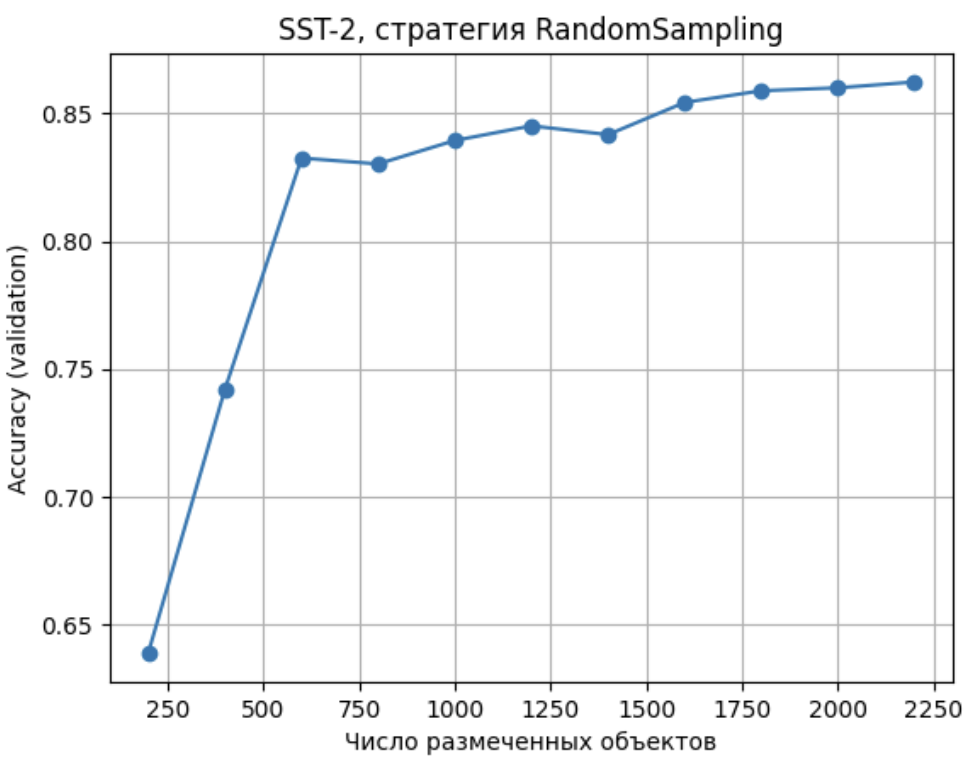
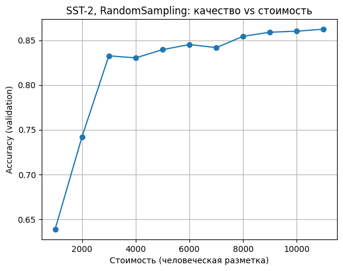
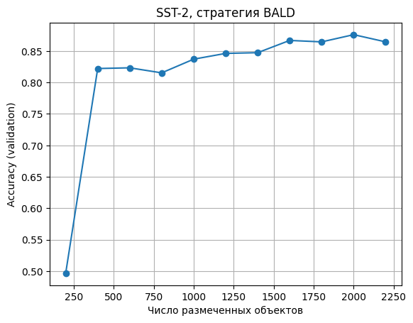

## 1. Датасеты

В рамках эксперимента я использую три текстовых датасета (HuggingFace datasets):
  - `glue/sst2`
  - `ag_news`
  - `hatexplain`
 
Далее -  анализ каждого датасета. Использованы официальнное разбиение на train/val/test.

Датасеты загружены с помощью пакета `datasets<3.0.0` и флага `trust_remote_code=True`.

Три датасета нормализованы с помощью map в схему:
  - `text`: raw text string
  - `label`: integer class id

### 1.1. SST-2 (GLUE)

**Описание задачи:** бинарная сентимент-классификация коротких фраз из пользовательских и художественных текстов. Необходимо определить эмоциональную окраску фразы. Класс 0 соответствует отрицательной оценке (negative), класс 1 — положительной (positive). 

Структура:

* Train: **67 349** примеров
* Validation: **872**
* Test: **1 821**

Распределение классов в train:

* 1 — **37 569**
* 0 — **29 780**

Есть небольшой дисбаланс классов.

Статистика длин текстов:

* Средняя длина: **9.41** слов
* Медиана: **7**
* 95-й перцентиль: **26** слов

```python
# Сырые данные до стандартизации:
{'sentence': 'hide new secretions from the parental units ', 
 'label': 0, 
 'idx': 0}

# Схема признаков:
'sentence': string  
'label': ClassLabel(names=['negative', 'positive'])  
'idx': int32

# После стандартизации:
{'label': 0, 'text': 'hide new secretions from the parental units '}
```

### **1.2. AG News**

**Описание задачи:** четырёхклассовая тематическая классификация новостных заголовков и коротких заметок. Классы распределены строго равномерно:
- 0 — World
- 1 — Sports
- 2 — Business
- 3 — Sci/Tech.

Структура:

* Train: **120 000**
* Test: **7 600**

Валидации нет — будем использовать часть train при необходимости.

Распределение классов (train):

* 0 — **30 000**
* 1 — **30 000**
* 2 — **30 000**
* 3 — **30 000**

Статистика длин текстов:

* Средняя длина: **37.85** слов
* Медиана: **37**
* 95-й перцентиль: **53** слова

В отличие от SST-2 тексты здесь длиннее.

```python
# Сырые данные до стандартизации:
{'text': "Wall St. Bears Claw Back Into the Black (Reuters)...", 
 'label': 2}

# Схема признаков:
'text': string  
'label': ClassLabel(names=['World', 'Sports', 'Business', 'Sci/Tech'])

# После стандартизации:
{'text': "...", 'label': 2}
```

### 1.3. HateXplain

**Описание задачи:** классификация токсичности:
- 0 — hatespeech (разжигание ненависти)
- 1 — normal (нейтральные высказывания)
- 2 — offensive (оскорбительная речь). 

Датасет собран из реальных социальных медиа. Для каждого примера присутствуют аннотации нескольких разметчиков; в ходе стандартизации я использую **majority vote**.

Структура:

* Train: **15 383**
* Validation: **1 922**
* Test: **1 924**

Распределение классов (train):

* 1 — **6 251**
* 0 — **4 748**
* 2 — **4 384**

Есть небольшой дисбаланс классов в сторону класса 1.

Статистика длин текстов:

* Средняя длина: **23.47** слов
* Медиана: **21**
* 95-й перцентиль: **49**

Тексты средней длины, но содержат специфические выражения, сленг и нестандартную орфографию.

```python
# Сырые данные до стандартизации:
{
 'id': '23107796_gab',
 'annotators': {
      'label': [0, 2, 2],
      'annotator_id': [...],
      'target': [...]
 },
 'rationales': [...],
 'post_tokens': ['u','really','think',...]
}

# Схема признаков:
id: string
annotators: sequence of dicts (label: ClassLabel([...]))
rationales: nested sequence
post_tokens: sequence of tokens

# После стандартизации:
{'text': 'u really think i would not have been raped ...', 
 'label': 2}
```

## 2. Модель

В качестве базовой модели для всех дальнейших экспериментов я использую
`DistilBERT-base-uncased` в конфигурации классификации последовательностей
(`DistilBertForSequenceClassification` из библиотеки `transformers`).

- Базовая модель: `distilbert-base-uncased`
- Токенизатор: `DistilBertTokenizerFast`
- Максимальная длина последовательности: `MAX_LENGTH = 128`
- Оптимизатор: `AdamW` с `lr = 5e-5`
- Устройство: `cuda`, если доступно, иначе `cpu`
- Формат данных после токенизации:
  - `input_ids: torch.LongTensor`
  - `attention_mask: torch.LongTensor`
  - `labels: torch.LongTensor`
  - поле `text` сохраняется для анализа

### 2.0 Тестовый пайплайн

Для базовой проверки работоспособности пайплайна проверим на небольшой выборке.

- Датасет: SST-2 (GLUE), бинарная классификация.
- Поднабор для обучения: первые 500 примеров train.
- Валидация: полная validation-выборка (872 примера).
- Параметры обучения:
  - число эпох: 1
  - batch size (train): 16
  - batch size (val): 32

Результаты:
```
- Train loss (1 epoch, 500 examples): 0.6245
- Validation accuracy: 0.7626
```

## 3. Реализация цикла Active Learning

В этом разделе я фиксирую результаты первых прогонов Active Learning на датасете SST-2, сравнивая стратегии выборки Random, Least Confidence, BALD, BADGE 

//TODO
. Все эксперименты выполнены в идентичном режиме: DistilBERT-base-uncased, одинаковый размер пула, одинаковый размер батчей, фиксированные seeds.

Будем использовать библиотеку small-text, в которой реализованы некоторые необходимы нам стратерии выборки.

Набор стратегий выборки:
- RandomSampling
- LeastConfidence (Uncertainty)
- BALD
- BADGE

ALPS и LLM-based acquisition будут реализованы далее.

Общие настройки для всех экспериментов:
- Пул: 10 000 примеров (случайная подвыборка из train)
- Начальная разметка: 200 примеров (balanced init)
- Размер AL-батча: 200
- Всего итераций: 10 (итог — 2200 размеченных)
- Модель: DistilBERT, обучение каждые 3 эпохи
- Оракул: человеческий (идеальный), стоимость = 5.0
- Метрика: accuracy и macro-F1 на валидации SST-2

### 3.0 Функция для одного эксперимента AL

`def run_al_experiment_one(dataset_key: str, standardized_datasets: Dict[str, Any], strategy_name: str, cfg: ALConfig = AL_CFG,)` 

Выполняет один полный эксперимент активного обучения (Active Learning) для заданного датасета, выбранной стратегии выборки, настроек классификатора и оракула (LLM или human). Функция реализует весь цикл AL: инициализацию labeled/pool наборов, выборку точек, запрос разметки, обновление обучающей выборки, переобучение модели и логирование метрик.

Аргументы:
- `strategy_name`: `random`, `least_conf`, `bald`, `badge`. Стратегия активного обучения (ALPS, BADGE, BALD, LC, Entropy, Random). 
- `standardized_datasets` - Структура, содержащая, `initial_labeled` : начальная обучающая выборка, `pool` : пул неразмеченных объектов, `test` : тестовая выборка.
- `clf_factory` - создает новый классификатор, совместимый с small-text
- `oracle` - Human или LLM
- `cfg` - Конфигурация эксперимента. Содержит параметры: `batch_size`, `max_iterations`, `budget`, `cost_function`, токенизации, параметры обучения модели и пр.    

Возвращает: 
- `ExperimentResult` -  Структура, содержащая, `history` : list[dict] - Метрики по итерациям. `final_model` : Classifier - Обученная модель после последнего шага AL. `labeled_indices` : list[int] - Набор всех выбранных объектов. `total_cost` : float - Общая стоимость аннотации. `auxiliary` : dict Вспомогательная информация для построения графиков.

Использование:
```python
results = run_al_experiment_one(
    strategy=strategy,
    dataset=raw_datasets["sst2"],
    clf_factory=make_classifier_factory(num_classes, cfg),
    oracle=oracle_llm,
    cfg=cfg
)
```

### 3.1 SST-2, стратегия Random Sampling (11min)

Random Sampling выступает в качестве базовой линии. Ожидаемо, кривая качества растёт плавно и монотонно. Ранние итерации дают наиболее резкий прирост (от ~0.64 до ~0.83). После ~1200 размеченных наблюдается замедление.

Логи эксперимента:

```
=== AL EXPERIMENT: dataset=sst2, strategy=random ===
Num classes: 2, eval split: validation
Pool size (subsampled): 10000 (original train: 67349)

Initial labeled: 200
[Iter 00] labeled= 200 | acc=0.6388 | macro_f1=0.6032 | cost_human=1000.0
[Iter 01] labeled= 400 | acc=0.7420 | macro_f1=0.7329 | cost_human=2000.0
[Iter 02] labeled= 600 | acc=0.8326 | macro_f1=0.8324 | cost_human=3000.0
[Iter 03] labeled= 800 | acc=0.8303 | macro_f1=0.8298 | cost_human=4000.0
[Iter 04] labeled=1000 | acc=0.8394 | macro_f1=0.8394 | cost_human=5000.0
[Iter 05] labeled=1200 | acc=0.8452 | macro_f1=0.8452 | cost_human=6000.0
[Iter 06] labeled=1400 | acc=0.8417 | macro_f1=0.8414 | cost_human=7000.0
[Iter 07] labeled=1600 | acc=0.8544 | macro_f1=0.8543 | cost_human=8000.0
[Iter 08] labeled=1800 | acc=0.8589 | macro_f1=0.8588 | cost_human=9000.0
[Iter 09] labeled=2000 | acc=0.8601 | macro_f1=0.8595 | cost_human=10000.0
[Iter 10] labeled=2200 | acc=0.8624 | macro_f1=0.8624 | cost_human=11000.0
```

`macro-F1` практически совпадает с `accuracy`.  


Рисунок 1. Динамика accuracy при Random Sampling


Рисунок 2. Accuracy от стоимости разметки при Random Sampling

### 3.2 SST-2, стратегия Least Confidence (Uncertainty Sampling) (17min)

Первые две итерации дают провал (модель выбирает самые сомнительные, но часто нерепрезентативные примеры), после чего кривая резко ускоряется и опережает Random.

Логи эксперимента:
```

=== AL EXPERIMENT: dataset=sst2, strategy=least_conf ===
Num classes: 2, eval split: validation
Pool size (subsampled): 10000 (original train: 67349)
Initial labeled: 200
[Iter 00] labeled= 200 | acc=0.5894 | macro_f1=0.5158 | cost_human=1000.0
[Iter 01] labeled= 400 | acc=0.5092 | macro_f1=0.3374 | cost_human=2000.0
[Iter 02] labeled= 600 | acc=0.8211 | macro_f1=0.8208 | cost_human=3000.0
[Iter 03] labeled= 800 | acc=0.8326 | macro_f1=0.8323 | cost_human=4000.0
[Iter 04] labeled=1000 | acc=0.8452 | macro_f1=0.8452 | cost_human=5000.0
[Iter 05] labeled=1200 | acc=0.8440 | macro_f1=0.8440 | cost_human=6000.0
[Iter 06] labeled=1400 | acc=0.8509 | macro_f1=0.8508 | cost_human=7000.0
[Iter 07] labeled=1600 | acc=0.8555 | macro_f1=0.8555 | cost_human=8000.0
[Iter 08] labeled=1800 | acc=0.8704 | macro_f1=0.8695 | cost_human=9000.0
[Iter 09] labeled=2000 | acc=0.8716 | macro_f1=0.8714 | cost_human=10000.0
[Iter 10] labeled=2200 | acc=0.8796 | macro_f1=0.8795 | cost_human=11000.0
```


Рисунок 1. Динамика accuracy при Least Confidence


Рисунок 2. Accuracy от стоимости разметки при Least Confidence

### 3.3 SST-2, стратегия BALD (MC Dropout) (7min)


```
=== AL EXPERIMENT: dataset=sst2, strategy=bald ===
Num classes: 2, eval split: validation
Pool size (subsampled): 10000 (original train: 67349)
Initial labeled: 200
[Iter 00] labeled= 200 | acc=0.4966 | macro_f1=0.3416 | cost_human=1000.0
Saving checkpoint to: /content/drive/MyDrive/al_two_oracles/models_checkpoints/sst2_bald/iter_00
/usr/local/lib/python3.12/dist-packages/torch/_tensor.py:1024: UserWarning: non-inplace resize is deprecated
  warnings.warn("non-inplace resize is deprecated")
[Iter 01] labeled= 400 | acc=0.8222 | macro_f1=0.8221 | cost_human=2000.0
Saving checkpoint to: /content/drive/MyDrive/al_two_oracles/models_checkpoints/sst2_bald/iter_01
/usr/local/lib/python3.12/dist-packages/torch/_tensor.py:1024: UserWarning: non-inplace resize is deprecated
  warnings.warn("non-inplace resize is deprecated")
[Iter 02] labeled= 600 | acc=0.8234 | macro_f1=0.8221 | cost_human=3000.0
Saving checkpoint to: /content/drive/MyDrive/al_two_oracles/models_checkpoints/sst2_bald/iter_02
/usr/local/lib/python3.12/dist-packages/torch/_tensor.py:1024: UserWarning: non-inplace resize is deprecated
  warnings.warn("non-inplace resize is deprecated")
[Iter 03] labeled= 800 | acc=0.8154 | macro_f1=0.8142 | cost_human=4000.0
Saving checkpoint to: /content/drive/MyDrive/al_two_oracles/models_checkpoints/sst2_bald/iter_03
/usr/local/lib/python3.12/dist-packages/torch/_tensor.py:1024: UserWarning: non-inplace resize is deprecated
  warnings.warn("non-inplace resize is deprecated")
[Iter 04] labeled=1000 | acc=0.8372 | macro_f1=0.8370 | cost_human=5000.0
Saving checkpoint to: /content/drive/MyDrive/al_two_oracles/models_checkpoints/sst2_bald/iter_04
/usr/local/lib/python3.12/dist-packages/torch/_tensor.py:1024: UserWarning: non-inplace resize is deprecated
  warnings.warn("non-inplace resize is deprecated")
[Iter 05] labeled=1200 | acc=0.8463 | macro_f1=0.8463 | cost_human=6000.0
Saving checkpoint to: /content/drive/MyDrive/al_two_oracles/models_checkpoints/sst2_bald/iter_05
/usr/local/lib/python3.12/dist-packages/torch/_tensor.py:1024: UserWarning: non-inplace resize is deprecated
  warnings.warn("non-inplace resize is deprecated")
[Iter 06] labeled=1400 | acc=0.8475 | macro_f1=0.8475 | cost_human=7000.0
Saving checkpoint to: /content/drive/MyDrive/al_two_oracles/models_checkpoints/sst2_bald/iter_06
/usr/local/lib/python3.12/dist-packages/torch/_tensor.py:1024: UserWarning: non-inplace resize is deprecated
  warnings.warn("non-inplace resize is deprecated")
[Iter 07] labeled=1600 | acc=0.8670 | macro_f1=0.8670 | cost_human=8000.0
Saving checkpoint to: /content/drive/MyDrive/al_two_oracles/models_checkpoints/sst2_bald/iter_07
/usr/local/lib/python3.12/dist-packages/torch/_tensor.py:1024: UserWarning: non-inplace resize is deprecated
  warnings.warn("non-inplace resize is deprecated")
[Iter 08] labeled=1800 | acc=0.8647 | macro_f1=0.8646 | cost_human=9000.0
Saving checkpoint to: /content/drive/MyDrive/al_two_oracles/models_checkpoints/sst2_bald/iter_08
/usr/local/lib/python3.12/dist-packages/torch/_tensor.py:1024: UserWarning: non-inplace resize is deprecated
  warnings.warn("non-inplace resize is deprecated")
[Iter 09] labeled=2000 | acc=0.8761 | macro_f1=0.8761 | cost_human=10000.0
Saving checkpoint to: /content/drive/MyDrive/al_two_oracles/models_checkpoints/sst2_bald/iter_09
/usr/local/lib/python3.12/dist-packages/torch/_tensor.py:1024: UserWarning: non-inplace resize is deprecated
  warnings.warn("non-inplace resize is deprecated")
[Iter 10] labeled=2200 | acc=0.8647 | macro_f1=0.8645 | cost_human=11000.0
Saving checkpoint to: /content/drive/MyDrive/al_two_oracles/models_checkpoints/sst2_bald/iter_10
History saved to:
  /content/drive/MyDrive/al_two_oracles/logs/sst2_bald_history.json
  /content/drive/MyDrive/al_two_oracles/logs/sst2_bald_history.csv
```


Рисунок 1. Динамика accuracy при BALD


Рисунок 2. Accuracy от стоимости разметки при BALD

В стратегии BALD видим самый слабый старт по метрике accuracy b F1-score.

