## 0. Глобальные настройки и общие функции

Для удобства добавлены функции для загркзки и выгрузки данных в гугл-диск (личный репозиторий).

После каждой AL-итерации сохраняется срез обученной модели:
1. веса модели. Хранится по пути `models_checkpoints/{dataset}_{strategy}/iter_{k}`
2. История эксперимента (логи). Хранятся по путям `logs/{dataset}_{strategy}_history.json`
`logs/{dataset}_{strategy}_history.csv`

## 1. Датасеты

В рамках эксперимента я использую три текстовых датасета (HuggingFace datasets):
  - `glue/sst2`
  - `ag_news`
  - `hatexplain`
 
Далее -  анализ каждого датасета. Использованы официальнное разбиение на train/val/test.

Датасеты загружены с помощью пакета `datasets<3.0.0` и флага `trust_remote_code=True`.

Три датасета нормализованы с помощью map в схему:
  - `text`: raw text string
  - `label`: integer class id

### 1.1. SST-2 (GLUE)

**Описание задачи:** бинарная сентимент-классификация коротких фраз из пользовательских и художественных текстов. Необходимо определить эмоциональную окраску фразы. Класс 0 соответствует отрицательной оценке (negative), класс 1 — положительной (positive). 

Структура:

* Train: **67 349** примеров
* Validation: **872**
* Test: **1 821**

Распределение классов в train:

* 1 — **37 569**
* 0 — **29 780**

Есть небольшой дисбаланс классов.

Статистика длин текстов:

* Средняя длина: **9.41** слов
* Медиана: **7**
* 95-й перцентиль: **26** слов

```python
# Сырые данные до стандартизации:
{'sentence': 'hide new secretions from the parental units ', 
 'label': 0, 
 'idx': 0}

# Схема признаков:
'sentence': string  
'label': ClassLabel(names=['negative', 'positive'])  
'idx': int32

# После стандартизации:
{'label': 0, 'text': 'hide new secretions from the parental units '}
```

### **1.2. AG News**

**Описание задачи:** четырёхклассовая тематическая классификация новостных заголовков и коротких заметок. Классы распределены строго равномерно:
- 0 — World
- 1 — Sports
- 2 — Business
- 3 — Sci/Tech.

Структура:

* Train: **120 000**
* Test: **7 600**

Валидации нет — будем использовать часть train при необходимости.

Распределение классов (train):

* 0 — **30 000**
* 1 — **30 000**
* 2 — **30 000**
* 3 — **30 000**

Статистика длин текстов:

* Средняя длина: **37.85** слов
* Медиана: **37**
* 95-й перцентиль: **53** слова

В отличие от SST-2 тексты здесь длиннее.

```python
# Сырые данные до стандартизации:
{'text': "Wall St. Bears Claw Back Into the Black (Reuters)...", 
 'label': 2}

# Схема признаков:
'text': string  
'label': ClassLabel(names=['World', 'Sports', 'Business', 'Sci/Tech'])

# После стандартизации:
{'text': "...", 'label': 2}
```

### 1.3. HateXplain

**Описание задачи:** классификация токсичности:
- 0 — hatespeech (разжигание ненависти)
- 1 — normal (нейтральные высказывания)
- 2 — offensive (оскорбительная речь). 

Датасет собран из реальных социальных медиа. Для каждого примера присутствуют аннотации нескольких разметчиков; в ходе стандартизации я использую **majority vote**.

Структура:

* Train: **15 383**
* Validation: **1 922**
* Test: **1 924**

Распределение классов (train):

* 1 — **6 251**
* 0 — **4 748**
* 2 — **4 384**

Есть небольшой дисбаланс классов в сторону класса 1.

Статистика длин текстов:

* Средняя длина: **23.47** слов
* Медиана: **21**
* 95-й перцентиль: **49**

Тексты средней длины, но содержат специфические выражения, сленг и нестандартную орфографию.

```python
# Сырые данные до стандартизации:
{
 'id': '23107796_gab',
 'annotators': {
      'label': [0, 2, 2],
      'annotator_id': [...],
      'target': [...]
 },
 'rationales': [...],
 'post_tokens': ['u','really','think',...]
}

# Схема признаков:
id: string
annotators: sequence of dicts (label: ClassLabel([...]))
rationales: nested sequence
post_tokens: sequence of tokens

# После стандартизации:
{'text': 'u really think i would not have been raped ...', 
 'label': 2}
```

## 2. Модель

В качестве базовой модели для всех дальнейших экспериментов я использую
`DistilBERT-base-uncased` в конфигурации классификации последовательностей
(`DistilBertForSequenceClassification` из библиотеки `transformers`).

- Базовая модель: `distilbert-base-uncased`
- Токенизатор: `DistilBertTokenizerFast`
- Максимальная длина последовательности: `MAX_LENGTH = 128`
- Оптимизатор: `AdamW` с `lr = 5e-5`
- Устройство: `cuda`, если доступно, иначе `cpu`
- Формат данных после токенизации:
  - `input_ids: torch.LongTensor`
  - `attention_mask: torch.LongTensor`
  - `labels: torch.LongTensor`
  - поле `text` сохраняется для анализа

### 2.0 Тестовый пайплайн

Для базовой проверки работоспособности пайплайна проверим на небольшой выборке.

- Датасет: SST-2 (GLUE), бинарная классификация.
- Поднабор для обучения: первые 500 примеров train.
- Валидация: полная validation-выборка (872 примера).
- Параметры обучения:
  - число эпох: 1
  - batch size (train): 16
  - batch size (val): 32

Результаты:
```
- Train loss (1 epoch, 500 examples): 0.6245
- Validation accuracy: 0.7626
```

## 3. Реализация цикла Active Learning

В этом разделе я фиксирую результаты первых прогонов Active Learning на датасете `SST-2`, `AG News`, `HateXplain`, сравнивая стратегии выборки `Random`, `Least Confidence`, `BALD`, `BADGE` 

. Все эксперименты выполнены в идентичном режиме: DistilBERT-base-uncased, одинаковый размер пула, одинаковый размер батчей, фиксированные seeds.

Будем использовать библиотеку small-text, в которой реализованы некоторые необходимы нам стратерии выборки.

Набор стратегий выборки:
- RandomSampling
- LeastConfidence (Uncertainty)
- BALD
- BADGE

`ALPS` и `LLM-based acquisition` будут реализованы далее.

Общие настройки для всех экспериментов:
- Пул: 10 000 примеров (случайная подвыборка из train)
- Начальная разметка: 200 примеров (balanced init)
- Размер AL-батча: 200
- Всего итераций: 10 (итог — 2200 размеченных)
- Модель: DistilBERT, обучение каждые 3 эпохи
- Оракул: человеческий (идеальный), стоимость = 5.0
- Метрика: accuracy и macro-F1 на валидации SST-2

### 3.0 Функция для одного эксперимента AL

`def run_al_experiment_one(dataset_key: str, standardized_datasets: Dict[str, Any], strategy_name: str, cfg: ALConfig = AL_CFG,)` 

Выполняет один полный эксперимент активного обучения (Active Learning) для заданного датасета, выбранной стратегии выборки, настроек классификатора и оракула (LLM или human). Функция реализует весь цикл AL: инициализацию labeled/pool наборов, выборку точек, запрос разметки, обновление обучающей выборки, переобучение модели и логирование метрик.

Аргументы:
- `strategy_name`: `random`, `least_conf`, `bald`, `badge`. Стратегия активного обучения (ALPS, BADGE, BALD, LC, Entropy, Random). 
- `standardized_datasets` - Структура, содержащая, `initial_labeled` : начальная обучающая выборка, `pool` : пул неразмеченных объектов, `test` : тестовая выборка.
- `clf_factory` - создает новый классификатор, совместимый с small-text
- `oracle` - Human или LLM
- `cfg` - Конфигурация эксперимента. Содержит параметры: `batch_size`, `max_iterations`, `budget`, `cost_function`, токенизации, параметры обучения модели и пр.    

Возвращает: 
- `ExperimentResult` -  Структура, содержащая, `history` : list[dict] - Метрики по итерациям. `final_model` : Classifier - Обученная модель после последнего шага AL. `labeled_indices` : list[int] - Набор всех выбранных объектов. `total_cost` : float - Общая стоимость аннотации. `auxiliary` : dict Вспомогательная информация для построения графиков.

Использование:
```python
results = run_al_experiment_one(
    strategy=strategy,
    dataset=raw_datasets["sst2"],
    clf_factory=make_classifier_factory(num_classes, cfg),
    oracle=oracle_llm,
    cfg=cfg
)
```

### 3.1.1 SST-2, стратегия Random Sampling (11min)

Random Sampling выступает в качестве базовой линии. Ожидаемо, кривая качества растёт плавно и монотонно. Ранние итерации дают наиболее резкий прирост (от ~0.64 до ~0.83). После ~1200 размеченных наблюдается замедление.

Логи эксперимента:

```
=== AL EXPERIMENT: dataset=sst2, strategy=random ===
Num classes: 2, eval split: validation
Pool size (subsampled): 10000 (original train: 67349)

Initial labeled: 200
[Iter 00] labeled= 200 | acc=0.6388 | macro_f1=0.6032 | cost_human=1000.0
[Iter 01] labeled= 400 | acc=0.7420 | macro_f1=0.7329 | cost_human=2000.0
[Iter 02] labeled= 600 | acc=0.8326 | macro_f1=0.8324 | cost_human=3000.0
[Iter 03] labeled= 800 | acc=0.8303 | macro_f1=0.8298 | cost_human=4000.0
[Iter 04] labeled=1000 | acc=0.8394 | macro_f1=0.8394 | cost_human=5000.0
[Iter 05] labeled=1200 | acc=0.8452 | macro_f1=0.8452 | cost_human=6000.0
[Iter 06] labeled=1400 | acc=0.8417 | macro_f1=0.8414 | cost_human=7000.0
[Iter 07] labeled=1600 | acc=0.8544 | macro_f1=0.8543 | cost_human=8000.0
[Iter 08] labeled=1800 | acc=0.8589 | macro_f1=0.8588 | cost_human=9000.0
[Iter 09] labeled=2000 | acc=0.8601 | macro_f1=0.8595 | cost_human=10000.0
[Iter 10] labeled=2200 | acc=0.8624 | macro_f1=0.8624 | cost_human=11000.0
```

`macro-F1` практически совпадает с `accuracy`.  


Рисунок 1. Динамика accuracy при Random Sampling


Рисунок 2. Accuracy от стоимости разметки при Random Sampling

### 3.1.2 SST-2, стратегия Least Confidence (Uncertainty Sampling) (17min)

Первые две итерации дают провал (модель выбирает самые сомнительные, но часто нерепрезентативные примеры), после чего кривая резко ускоряется и опережает Random.

Логи эксперимента:
```

=== AL EXPERIMENT: dataset=sst2, strategy=least_conf ===
Num classes: 2, eval split: validation
Pool size (subsampled): 10000 (original train: 67349)
Initial labeled: 200
[Iter 00] labeled= 200 | acc=0.5894 | macro_f1=0.5158 | cost_human=1000.0
[Iter 01] labeled= 400 | acc=0.5092 | macro_f1=0.3374 | cost_human=2000.0
[Iter 02] labeled= 600 | acc=0.8211 | macro_f1=0.8208 | cost_human=3000.0
[Iter 03] labeled= 800 | acc=0.8326 | macro_f1=0.8323 | cost_human=4000.0
[Iter 04] labeled=1000 | acc=0.8452 | macro_f1=0.8452 | cost_human=5000.0
[Iter 05] labeled=1200 | acc=0.8440 | macro_f1=0.8440 | cost_human=6000.0
[Iter 06] labeled=1400 | acc=0.8509 | macro_f1=0.8508 | cost_human=7000.0
[Iter 07] labeled=1600 | acc=0.8555 | macro_f1=0.8555 | cost_human=8000.0
[Iter 08] labeled=1800 | acc=0.8704 | macro_f1=0.8695 | cost_human=9000.0
[Iter 09] labeled=2000 | acc=0.8716 | macro_f1=0.8714 | cost_human=10000.0
[Iter 10] labeled=2200 | acc=0.8796 | macro_f1=0.8795 | cost_human=11000.0
```

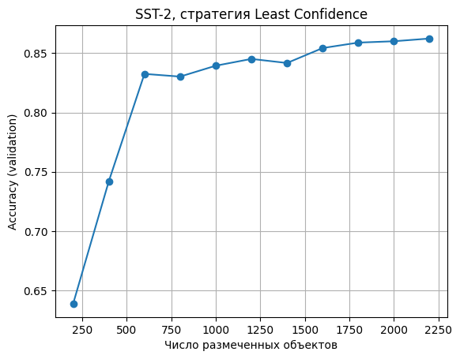
Рисунок 1. Динамика accuracy при Least Confidence

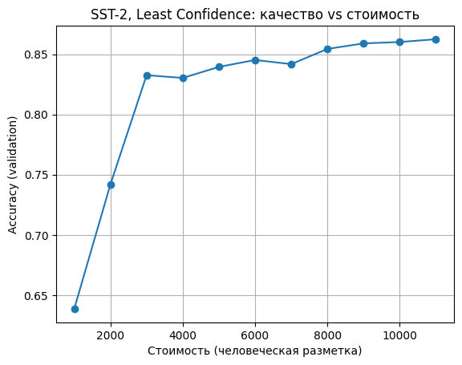
Рисунок 2. Accuracy от стоимости разметки при Least Confidence

### 3.1.3 SST-2, стратегия BALD (MC Dropout) (7min)


```
=== AL EXPERIMENT: dataset=sst2, strategy=bald ===
Num classes: 2, eval split: validation
Pool size (subsampled): 10000 (original train: 67349)
Initial labeled: 200
[Iter 00] labeled= 200 | acc=0.4966 | macro_f1=0.3416 | cost_human=1000.0
Saving checkpoint to: /content/drive/MyDrive/al_two_oracles/models_checkpoints/sst2_bald/iter_00
/usr/local/lib/python3.12/dist-packages/torch/_tensor.py:1024: UserWarning: non-inplace resize is deprecated
  warnings.warn("non-inplace resize is deprecated")
[Iter 01] labeled= 400 | acc=0.8222 | macro_f1=0.8221 | cost_human=2000.0
Saving checkpoint to: /content/drive/MyDrive/al_two_oracles/models_checkpoints/sst2_bald/iter_01
/usr/local/lib/python3.12/dist-packages/torch/_tensor.py:1024: UserWarning: non-inplace resize is deprecated
  warnings.warn("non-inplace resize is deprecated")
[Iter 02] labeled= 600 | acc=0.8234 | macro_f1=0.8221 | cost_human=3000.0
Saving checkpoint to: /content/drive/MyDrive/al_two_oracles/models_checkpoints/sst2_bald/iter_02
/usr/local/lib/python3.12/dist-packages/torch/_tensor.py:1024: UserWarning: non-inplace resize is deprecated
  warnings.warn("non-inplace resize is deprecated")
[Iter 03] labeled= 800 | acc=0.8154 | macro_f1=0.8142 | cost_human=4000.0
Saving checkpoint to: /content/drive/MyDrive/al_two_oracles/models_checkpoints/sst2_bald/iter_03
/usr/local/lib/python3.12/dist-packages/torch/_tensor.py:1024: UserWarning: non-inplace resize is deprecated
  warnings.warn("non-inplace resize is deprecated")
[Iter 04] labeled=1000 | acc=0.8372 | macro_f1=0.8370 | cost_human=5000.0
Saving checkpoint to: /content/drive/MyDrive/al_two_oracles/models_checkpoints/sst2_bald/iter_04
/usr/local/lib/python3.12/dist-packages/torch/_tensor.py:1024: UserWarning: non-inplace resize is deprecated
  warnings.warn("non-inplace resize is deprecated")
[Iter 05] labeled=1200 | acc=0.8463 | macro_f1=0.8463 | cost_human=6000.0
Saving checkpoint to: /content/drive/MyDrive/al_two_oracles/models_checkpoints/sst2_bald/iter_05
/usr/local/lib/python3.12/dist-packages/torch/_tensor.py:1024: UserWarning: non-inplace resize is deprecated
  warnings.warn("non-inplace resize is deprecated")
[Iter 06] labeled=1400 | acc=0.8475 | macro_f1=0.8475 | cost_human=7000.0
Saving checkpoint to: /content/drive/MyDrive/al_two_oracles/models_checkpoints/sst2_bald/iter_06
/usr/local/lib/python3.12/dist-packages/torch/_tensor.py:1024: UserWarning: non-inplace resize is deprecated
  warnings.warn("non-inplace resize is deprecated")
[Iter 07] labeled=1600 | acc=0.8670 | macro_f1=0.8670 | cost_human=8000.0
Saving checkpoint to: /content/drive/MyDrive/al_two_oracles/models_checkpoints/sst2_bald/iter_07
/usr/local/lib/python3.12/dist-packages/torch/_tensor.py:1024: UserWarning: non-inplace resize is deprecated
  warnings.warn("non-inplace resize is deprecated")
[Iter 08] labeled=1800 | acc=0.8647 | macro_f1=0.8646 | cost_human=9000.0
Saving checkpoint to: /content/drive/MyDrive/al_two_oracles/models_checkpoints/sst2_bald/iter_08
/usr/local/lib/python3.12/dist-packages/torch/_tensor.py:1024: UserWarning: non-inplace resize is deprecated
  warnings.warn("non-inplace resize is deprecated")
[Iter 09] labeled=2000 | acc=0.8761 | macro_f1=0.8761 | cost_human=10000.0
Saving checkpoint to: /content/drive/MyDrive/al_two_oracles/models_checkpoints/sst2_bald/iter_09
/usr/local/lib/python3.12/dist-packages/torch/_tensor.py:1024: UserWarning: non-inplace resize is deprecated
  warnings.warn("non-inplace resize is deprecated")
[Iter 10] labeled=2200 | acc=0.8647 | macro_f1=0.8645 | cost_human=11000.0
Saving checkpoint to: /content/drive/MyDrive/al_two_oracles/models_checkpoints/sst2_bald/iter_10
History saved to:
  /content/drive/MyDrive/al_two_oracles/logs/sst2_bald_history.json
  /content/drive/MyDrive/al_two_oracles/logs/sst2_bald_history.csv
```


Рисунок 1. Динамика accuracy при BALD

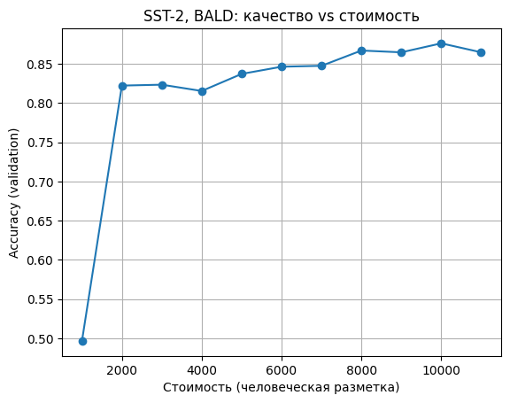
Рисунок 2. Accuracy от стоимости разметки при BALD

В стратегии BALD видим самый слабый старт по метрике accuracy b F1-score.

### 3.1.4  SST-2, стратегия BADGE

В ходе экспериментов с использованием стратегии BADGE возникла техническая
несовместимость между реализацией DistilBertForSequenceClassification (библиотека
`transformers`) и реализацией BADGE в библиотеке `small-text`. Проблема разрешена.

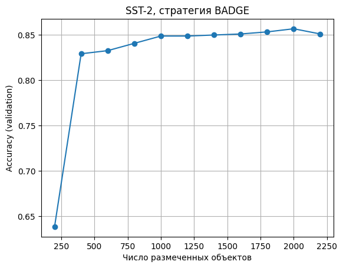
Рисунок 1. Динамика accuracy при BADGE

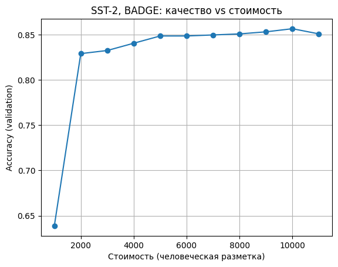
Рисунок 2. Accuracy от стоимости разметки при BADGE

### 3.5 Сводная таблица

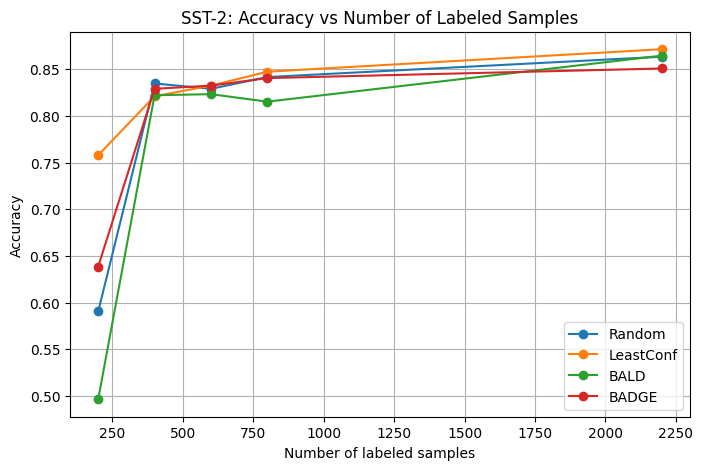

Ниже сведены результаты четырёх стратегий: Random, Least Confidence (LC), BALD и BADGE на точках обучающего набора: 200, 400, 600, 800 и 2200 размеченных примеров.


**Accuracy / Macro-F1 на валидации при различном количестве размеченных примеров**

| # labeled | **Random**      | **LC (Least Confidence)** | **BALD**        | **BADGE**       |
| --------- | --------------- | ------------------------- | --------------- | --------------- |
| **200**   | 0.5906 / 0.5136 | **0.7580 / 0.7558**       | 0.4966 / 0.3416 | 0.6388 / 0.6032 |
| **400**   | 0.8349 / 0.8346 | 0.8211 / 0.8211           | 0.8222 / 0.8221 | 0.8291 / 0.8287 |
| **600**   | 0.8291 / 0.8289 | 0.8326 / 0.8324           | 0.8234 / 0.8221 | 0.8326 / 0.8326 |
| **800**   | 0.8417 / 0.8415 | **0.8475 / 0.8475**       | 0.8154 / 0.8142 | 0.8406 / 0.8406 |
| **2200**  | 0.8635 / 0.8635 | **0.8716 / 0.8715**       | 0.8647 / 0.8645 | 0.8509 / 0.8509 |


1. **Least Confidence — наиболее выгодная стратегия при холодном старте и по динамике роста качества.** Её преимущество формируется уже на 200 примерах и сохраняется до финала.
2. Random неожиданно хорош как baseline
3. BALD демонстрирует нестабильность, как и ожидалось в самом начале, однако начинает работать адекватно уже с 400 размеченных примеров.
4. **BADGE обеспечивает стабильный, гладкий рост качества**, но проигрывает LC на поздних стадиях эксперимента.

### 3.2 Базовые эксперименты на AG News

### 3.2 Базовые эксперименты на AG News

В этом подпункте я фиксирую результаты первых прогонов Active Learning на датасете `AG News`. Настройки эксперимента полностью совпадают с SST-2: DistilBERT-base-uncased, пул в 10 000 объектов, начальные 200 размеченных, батч AL в 200 примеров и 10 итераций AL (всего до 2200 размеченных).
В отличие от SST-2, здесь задача четырёхклассовой тематической классификации новостей (`World / Sports / Business / Sci/Tech`), и в качестве валидационного набора используется официальный `test` сплит.

Метрики: accuracy и macro-F1 на тестовой выборке AG News.

---

### 3.2.1 AG News, стратегия Random Sampling

Random Sampling снова используется как базовая линия. Уже при 200 размеченных примерах модель даёт довольно высокое качество (~0.84), что отражает относительную простоту задач на AG News для DistilBERT. Дальнейшее увеличение числа меток приводит к плавному росту accuracy и F1 до уровня около 0.89.

Логи эксперимента:

```text
Initial labeled: 200
[Iter 00] labeled= 200 | acc=0.8374 | macro_f1=0.8364 | cost_human=1000.0
[Iter 01] labeled= 400 | acc=0.8408 | macro_f1=0.8380 | cost_human=2000.0
[Iter 02] labeled= 600 | acc=0.8784 | macro_f1=0.8780 | cost_human=3000.0
[Iter 03] labeled= 800 | acc=0.8868 | macro_f1=0.8865 | cost_human=4000.0
[Iter 04] labeled=1000 | acc=0.8883 | macro_f1=0.8880 | cost_human=5000.0
[Iter 05] labeled=1200 | acc=0.8889 | macro_f1=0.8885 | cost_human=6000.0
[Iter 06] labeled=1400 | acc=0.8912 | macro_f1=0.8907 | cost_human=7000.0
[Iter 07] labeled=1600 | acc=0.8921 | macro_f1=0.8919 | cost_human=8000.0
[Iter 08] labeled=1800 | acc=0.8938 | macro_f1=0.8938 | cost_human=9000.0
[Iter 09] labeled=2000 | acc=0.8953 | macro_f1=0.8951 | cost_human=10000.0
[Iter 10] labeled=2200 | acc=0.8892 | macro_f1=0.8886 | cost_human=11000.0
```

Кривая качества в целом монотонно растёт, небольшое падение на последней итерации можно считать флуктуацией обучения.

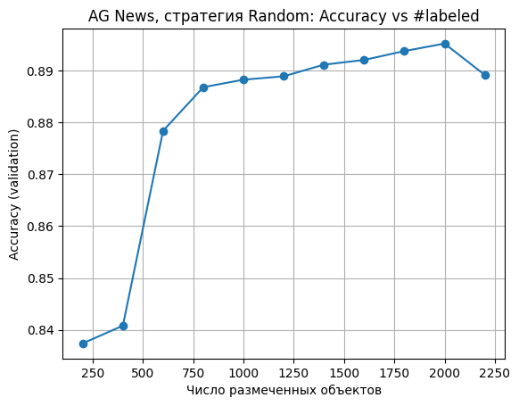
Рисунок 3. Динамика accuracy при Random Sampling на AG News

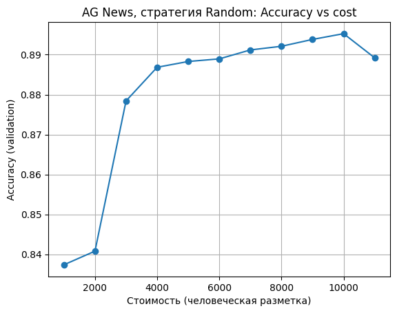
Рисунок 4. Accuracy от стоимости разметки при Random Sampling на AG News

---

### 3.2.2 AG News, стратегия Least Confidence (Uncertainty Sampling)

Для стратегии Least Confidence поведение в целом аналогично SST-2: стратегия использует неопределённость модели для выбора примеров. Однако на AG News сильного «провала» в начале, как на SST-2, нет — старт уже достаточно высокий, и далее кривая довольно быстро выходит в зону >0.90.

Логи эксперимента:

```text
=== AL EXPERIMENT: dataset=ag_news, strategy=least_conf ===
Num classes: 4, eval split: test
Pool size (subsampled): 10000 (original train: 120000)
Initial labeled: 200
[Iter 00] labeled= 200 | acc=0.8295 | macro_f1=0.8278 | cost_human=1000.0
[Iter 01] labeled= 400 | acc=0.8634 | macro_f1=0.8645 | cost_human=2000.0
[Iter 02] labeled= 600 | acc=0.8395 | macro_f1=0.8337 | cost_human=3000.0
[Iter 03] labeled= 800 | acc=0.8759 | macro_f1=0.8755 | cost_human=4000.0
[Iter 04] labeled=1000 | acc=0.8916 | macro_f1=0.8916 | cost_human=5000.0
[Iter 05] labeled=1200 | acc=0.8987 | macro_f1=0.8982 | cost_human=6000.0
[Iter 06] labeled=1400 | acc=0.9012 | macro_f1=0.9008 | cost_human=7000.0
[Iter 07] labeled=1600 | acc=0.9045 | macro_f1=0.9042 | cost_human=8000.0
[Iter 08] labeled=1800 | acc=0.9043 | macro_f1=0.9040 | cost_human=9000.0
[Iter 09] labeled=2000 | acc=0.9068 | macro_f1=0.9067 | cost_human=10000.0
[Iter 10] labeled=2200 | acc=0.9108 | macro_f1=0.9106 | cost_human=11000.0
History saved to:
  .../ag_news_least_conf_history.json
  .../ag_news_least_conf_history.csv
```

Видно небольшой локальный спад на 600 примерах, но дальше LC уверенно выходит в лидеры и даёт лучшее финальное качество среди всех стратегий (~0.911 accuracy и macro-F1).


Рисунок 5. Динамика accuracy при Least Confidence на AG News

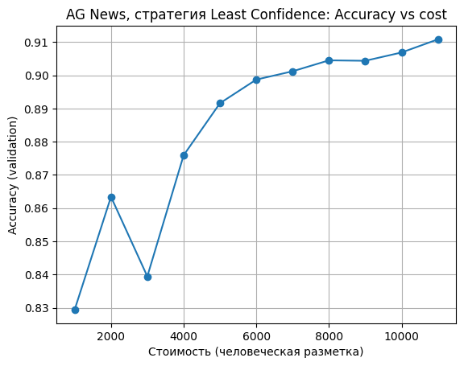
Рисунок 6. Accuracy от стоимости разметки при Least Confidence на AG News

---

### 3.2.3 AG News, стратегия BALD (MC Dropout)

На AG News стратегия BALD ведёт себя заметно стабильнее, чем на SST-2. Здесь нет провала на нулевой итерации: модель стартует с теми же ~0.84, как и Random, и далее постепенно улучшает качество до уровня около 0.908.

Логи эксперимента:

```text
Initial labeled: 200
[Iter 00] labeled= 200 | acc=0.8374 | macro_f1=0.8364 | cost_human=1000.0
[Iter 01] labeled= 400 | acc=0.8589 | macro_f1=0.8578 | cost_human=2000.0
[Iter 02] labeled= 600 | acc=0.8738 | macro_f1=0.8731 | cost_human=3000.0
[Iter 03] labeled= 800 | acc=0.8795 | macro_f1=0.8788 | cost_human=4000.0
[Iter 04] labeled=1000 | acc=0.8845 | macro_f1=0.8837 | cost_human=5000.0
[Iter 05] labeled=1200 | acc=0.8972 | macro_f1=0.8967 | cost_human=6000.0
[Iter 06] labeled=1400 | acc=0.9032 | macro_f1=0.9029 | cost_human=7000.0
[Iter 07] labeled=1600 | acc=0.9024 | macro_f1=0.9022 | cost_human=8000.0
[Iter 08] labeled=1800 | acc=0.9017 | macro_f1=0.9016 | cost_human=9000.0
[Iter 09] labeled=2000 | acc=0.9028 | macro_f1=0.9024 | cost_human=10000.0
[Iter 10] labeled=2200 | acc=0.9078 | macro_f1=0.9075 | cost_human=11000.0
```

Финальное качество BALD немного уступает LC, но заметно превосходит Random. Небольшие флуктуации на поздних итерациях (1600–2000 примеров) выглядят как нормальная вариативность стохастического обучения и MC Dropout.

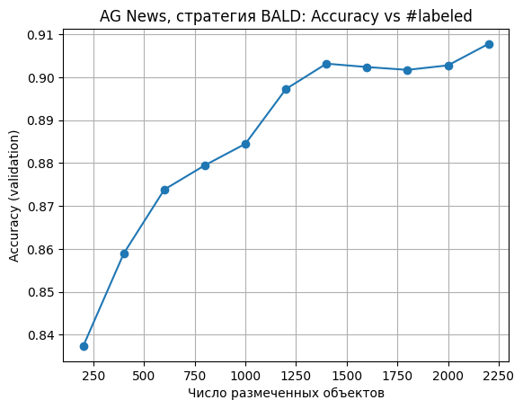
Рисунок 7. Динамика accuracy при BALD на AG News

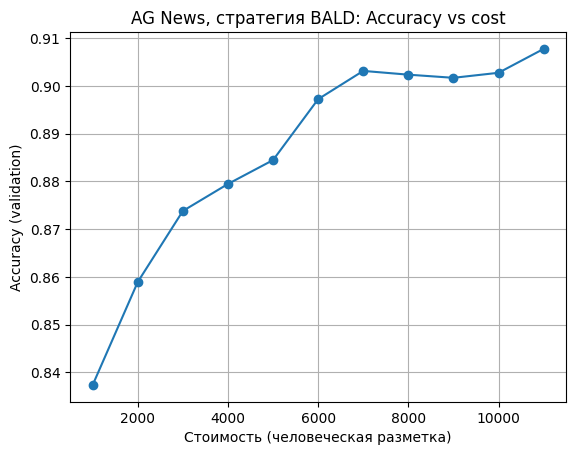
Рисунок 8. Accuracy от стоимости разметки при BALD на AG News

---

### 3.2.4 AG News, стратегия BADGE

Для BADGE используется кластеризация градиентных эмбеддингов, поэтому в логах появляются предупреждения вида `kmeans_plusplus returned identical cluster centers`. Это свидетельствует о том, что в некоторых шагах k-means получает очень похожие точки, но по кривой качества видно, что на итоговый результат это существенно не влияет.

Логи эксперимента:

```text
Initial labeled: 200
[Iter 00] labeled= 200 | acc=0.8374 | macro_f1=0.8364 | cost_human=1000.0
[Iter 01] labeled= 400 | acc=0.8636 | macro_f1=0.8625 | cost_human=2000.0
[Iter 02] labeled= 600 | acc=0.8742 | macro_f1=0.8736 | cost_human=3000.0
[Iter 03] labeled= 800 | acc=0.8795 | macro_f1=0.8793 | cost_human=4000.0
[Iter 04] labeled=1000 | acc=0.8878 | macro_f1=0.8874 | cost_human=5000.0
[Iter 05] labeled=1200 | acc=0.8887 | macro_f1=0.8881 | cost_human=6000.0
[Iter 06] labeled=1400 | acc=0.8968 | macro_f1=0.8964 | cost_human=7000.0
[Iter 07] labeled=1600 | acc=0.8958 | macro_f1=0.8956 | cost_human=8000.0
[Iter 08] labeled=1800 | acc=0.9007 | macro_f1=0.9004 | cost_human=9000.0
[Iter 09] labeled=2000 | acc=0.8997 | macro_f1=0.8995 | cost_human=10000.0
[Iter 10] labeled=2200 | acc=0.9008 | macro_f1=0.9007 | cost_human=11000.0
```

Кривая BADGE очень гладкая и монотонная, с небольшими колебаниями в районе 1600–2000 примеров. Итоговое качество (~0.901) чуть ниже, чем у LC и BALD, но выше Random.

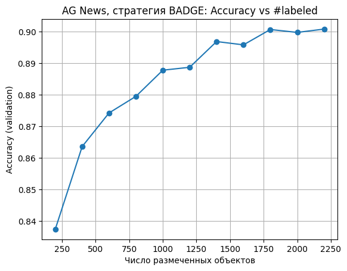
Рисунок 9. Динамика accuracy при BADGE на AG News

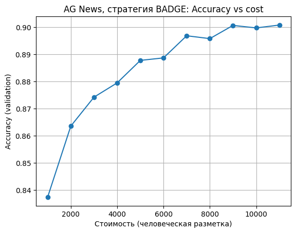
Рисунок 10. Accuracy от стоимости разметки при BADGE на AG News

---

### 3.2.5 Короткие выводы по AG News


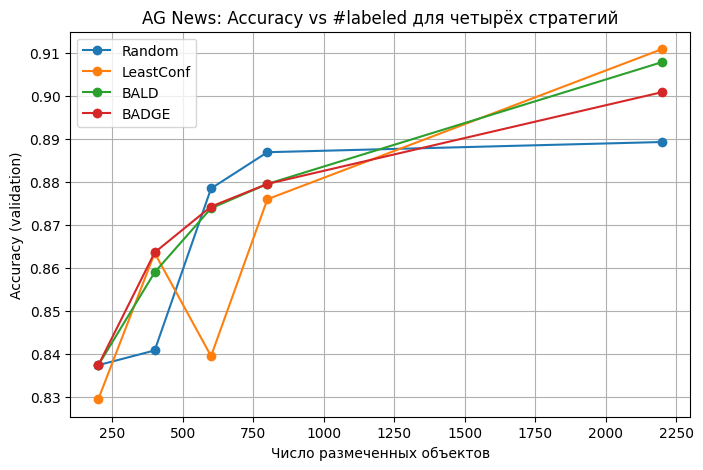

1. **Все стратегии стартуют с высоким качеством (≈0.83–0.84 на 200 примерах)**, что отражает сравнительную простоту датасета AG News для DistilBERT: даже небольшой объём разметки даёт хорошую генерализацию.
2. **Least Confidence вновь показывает лучший финальный результат** (~0.91 accuracy / macro-F1), стабильно опережая Random и немного опережая BALD/BADGE.
3. **BALD и BADGE ведут себя заметно стабильнее, чем на SST-2**: на AG News нет провала в начале, обе стратегии дают плавный рост качества и финально оказываются между Random и LC.
4. **Разница между стратегиями меньше, чем на SST-2**: все кривые довольно быстро «прилипают» к плато около 0.90. Это согласуется с тем, что классы AG News хорошо разделимы и сбалансированы, и преимуществу активного обучения сложнее проявиться в виде большого отрыва от Random.

## 4.0 Выбор LLM-оракула и интеграция GigaChat API

Для реализации сценариев с двумя оракулами (человеческим и LLM) я выбрала в качестве
LLM-оракула модель GigaChat от Сбера, доступную через GigaChat API. Для физических лиц
предоставляется бесплатный пакет Freemium с лимитом в 1 000 000 токенов в год, что
достаточно для экспериментов с разметкой небольших текстов. Работа с API организована
через официальную Python-библиотеку `gigachat`, которая берёт на себя получение и
обновление токена доступа.

В каждом эксперименте с активным обучением я рассматриваю несколько сценариев:
- **Human-only**: метки для выбранных объектов берутся из gold-лейблов датасета и
  интерпретируются как ответы идеального человека-оракула.
- **LLM-only**: все новые метки выдаёт GigaChat, при этом модель обучается на
  потенциально шумной разметке, а качество оценивается по gold-лейблам.
- **Hybrid (cold-start на LLM)**: на ранних итерациях (в зоне холодного старта) метки
  выдаёт LLM, после достижения порогового числа размеченных объектов (например, 800)
  роли переходит к человеку-оракулу. Это позволяет оценить, насколько выгодно
  использовать дешёвый LLM-бюджет на начальном этапе, а более дорогую человеческую
  разметку оставлять на финальные итерации.

Для каждого датасета (SST-2, AG News, HateXplain) я задаю явное словесное описание задачи
и фиксированный набор классов. В запросе к GigaChat модель просится вернуть только JSON
вида `{"label": "<имя_класса>"}`, что упрощает автоматический парсинг и снижает риск
форматных ошибок. Человеческий и LLM-оракулы моделируются в едином AL-пайплайне через
параметр `oracle_type`, а стоимость разметки начисляется в терминах `cost_human` и
`cost_llm` согласно заданной мат-модели.
